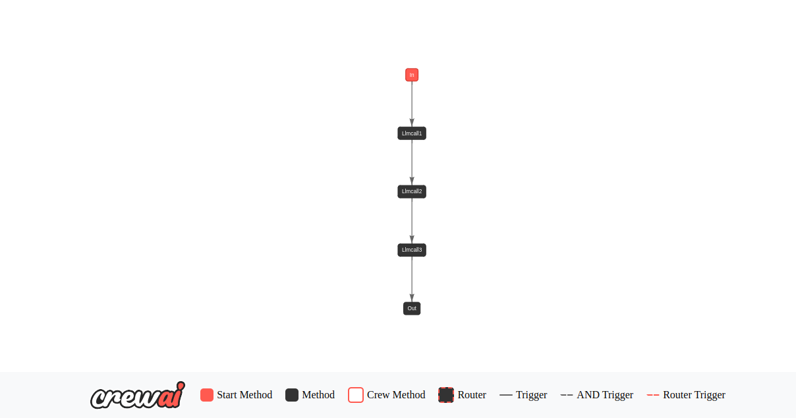
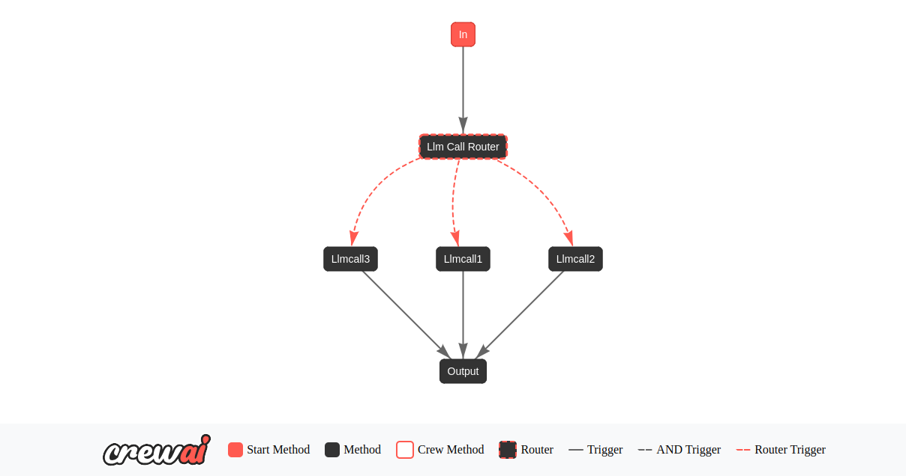
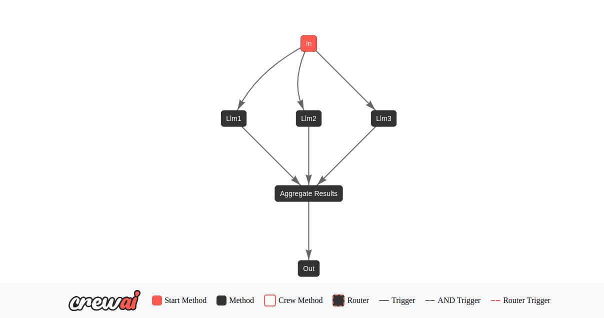
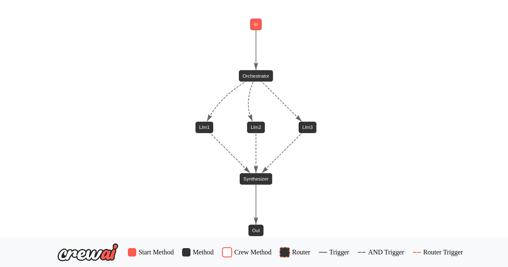
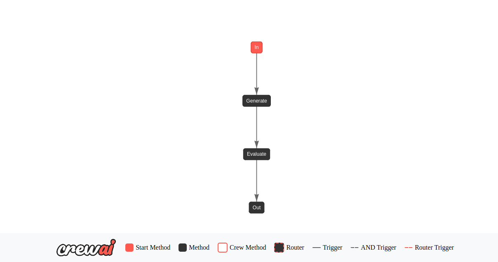

# 🚀 CrewAI for Beginners - Simplifying Agentic AI

## **About the Project**

This project is designed to help beginners understand and implement **Agentic AI** using **CrewAI**. Inspired by **Anthropic's research on AI agent flows**, I have created **beginner-friendly agent flows** that work **without requiring LLM dependencies**, making it easier to grasp the core concepts of AI automation.

✅ **Easy-to-follow agent flows**  
✅ **Beginner-friendly code structure**  
✅ **Step-by-step agent workflows**  

If you're new to **Agentic AI & CrewAI**, this project will provide a **clear understanding** of how AI agents work.  

---

## **📥 Installation & Setup**

Follow the steps below to set up and run the project:

### **1️⃣ Install `uv` (Universal Virtual Environment Manager)**
```bash
pip install uv
```

### **2️⃣ Clone the Repository**
```bash
git clone https://github.com/ikhlasbhojani/crewai-for-Beginner.git
```

### **3️⃣ Open the Project in VS Code**
```bash
cd crewai-for-Beginner
code .
```

### **4️⃣ Create a Virtual Environment**
```bash
uv venv
```

### **5️⃣ Activate the Virtual Environment**
#### **For MacOS & Linux:**
```bash
source .venv/bin/activate
```

#### **For Windows:**
```powershell
.venv\Scripts\activate
```

### **6️⃣ Install Dependencies**
```bash
uv pip install -r requirements.txt
```

### **7️⃣ Run the Project**
```bash
uv run [variable_name]
```
📌 **Note:** The `[variable_name]` should match the script name defined in the `[project.scripts]` section of your `pyproject.toml` file.

---

## **🔍 CrewAI Graphs **

### Simple Flow Graph


### Router Flow Graph


### Parallel Flow Graph


### Orchestrator Flow Graph


### Evaluator Flow Graph



## **📚 Learn More & Contribute**

🔗 **GitHub Repo:** [CrewAI for Beginners](https://github.com/ikhlasbhojani/crewai-for-Beginner.git)  
💬 If you're also exploring **CrewAI & AI Agents**, feel free to connect! I’d love to hear your thoughts and feedback.  

#AgenticAI #CrewAI #AIAgents #Automation #MachineLearning #AIResearch #Anthropic #OpenSource

